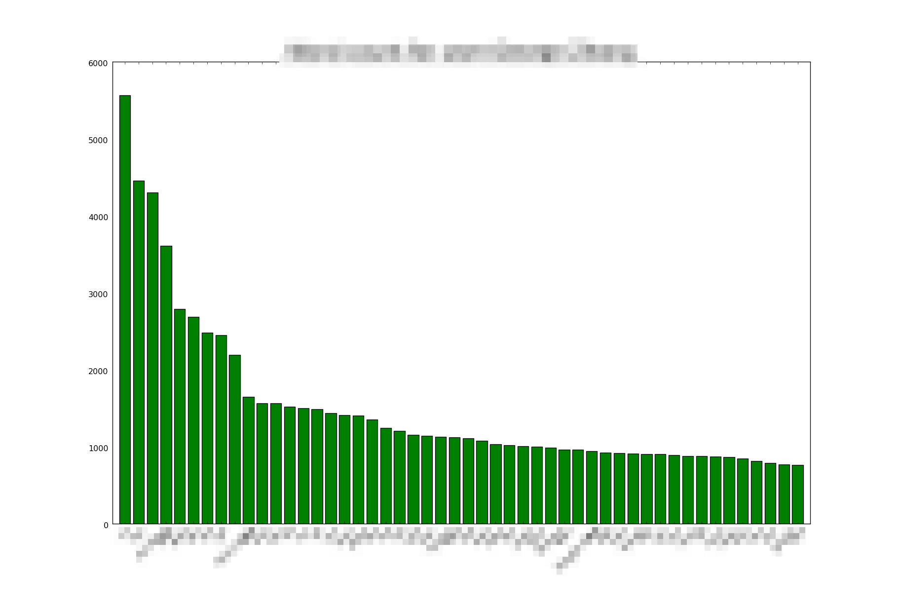

# Facebook Messages

Generates plots of user word count and simulated user messages based off of user's previous messages.



[How to download Facebook Data.](https://www.facebook.com/help/131112897028467) From this, extract the chat html from appropriate file in messages/ folder.

See the README.md in data/ folder also. Example usage, assuming facebook html chat data is stored in 1.html and 2.html:

```
# Only generate plots
python process_all.py 1.html

# Simulate entire chat and generate aliased charts
# (Real names are replaced by aliases, explained in data/README.md)
# May be slow if large chats are simulated
# Do not include spaces between 1.html and 2.html
python process_all.py 1.html,2.html --simulate True --alias True

# Simulate single user and generate non-aliased charts
# Use underscores for spaces in names
python process_all.py 1.html --simulate True --user insert_name

```

Dependencies: 
* lxml for parsing HTML chatlog file
* nltk and markovify for natural language processing & markov-chain text generation
* matplotlib to generate charts